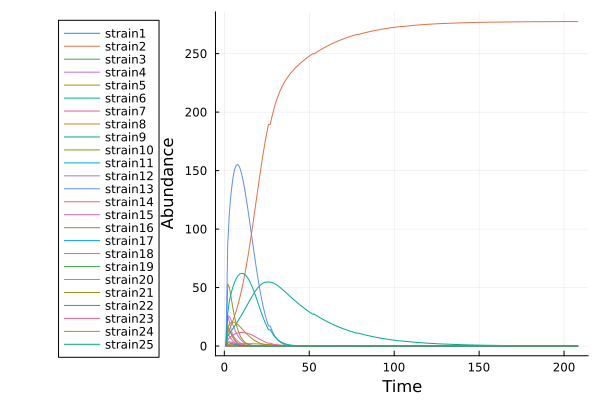
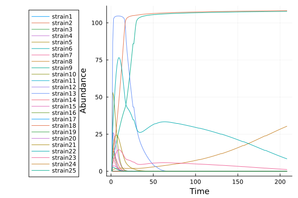

### Find equilibrium community composition of initially populated community

```julia
using MiCroSim

n_resources = 12 # set the number of resources

# create universal metabolism of a 12 resource system
D, W_ba = create_metabolism(n_resources=n_resources)

# generate a pool of 5 families, each with 10 members
pool = create_species_pool(D, n_families=5, family_size=10)

# sample 25 initially present species from the pool
sample = sample_pool(pool, 25,  0)

# simulate dynamics with host regulation turned off
out = generic_run(sample, D=D, W_ba=W_ba, phi=0.0, t_span=(0, 200), host_regulation=false, path="full/path/to/output/folder/")

# since plot is set to true by default, you will find some figures illustrating your simulation results is your specified directory
```

Since there is no host regulation, and only a single summplied resource (default), only the species with the most favorable metabolic profile survives, as illustrated on the plot below:




With host regulation enabled, multiple species can survive:



Although in this case, we might want to midify t_span becasue it takes longer to reach the equilibrium state